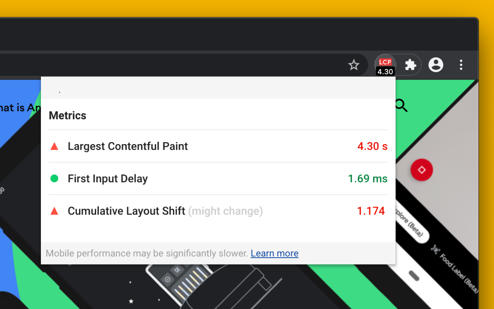
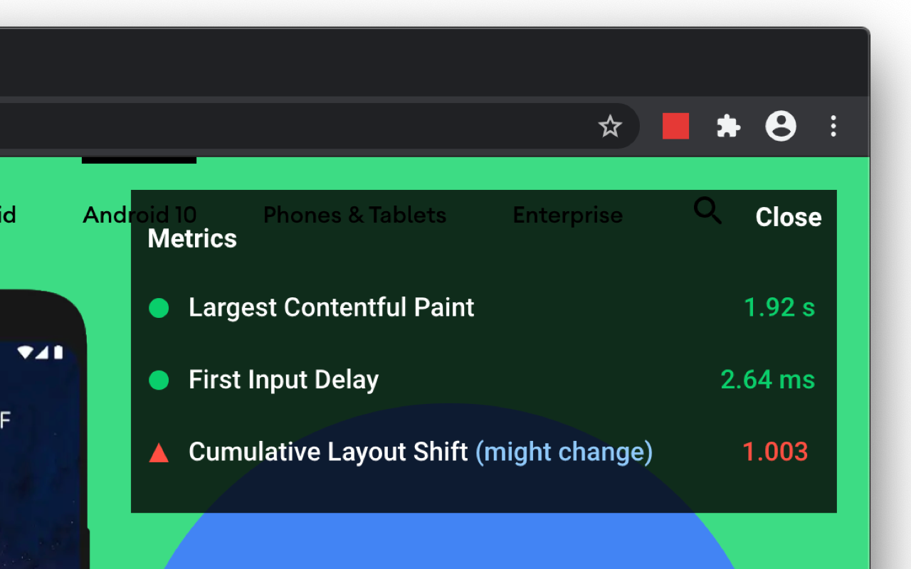

# Web Vitals Chrome Extension
*A Chrome extension to measure metrics for a healthy site*

This extension measures the three [Core Web Vitals](https://web.dev/vitals) metrics in a way that matches how they're measured by Chrome and reported to other Google tools (e.g. [Chrome User Experience Report](https://developers.google.com/web/tools/chrome-user-experience-report), [Page Speed Insights](https://developers.google.com/speed/pagespeed/insights/), [Search Console](https://search.google.com/search-console/about)).

The extensions supports all of the [Core Web Vitals](https://web.dev/vitals/#core-web-vitals) and leverages the [web-vitals](https://github.com/GoogleChrome/web-vitals) library under the hood to capture:

* [Largest Contentful Paint](https://web.dev/lcp)
* [Cumulative Layout Shift](https://web.dev/cls)
* [First Input Delay](https://web.dev/fid)

### Installation Instructions

**Google Chrome**
1. Download this repo as a [ZIP file from GitHub](https://github.com/googlechrome/web-vitals-extension/archive/master.zip).
1. Unzip the file and you should have a folder named `web-vitals-extension-master`.
1. In Chrome go to the extensions page (`chrome://extensions`).
1. Enable Developer Mode.
1. Drag the `web-vitals-extension-master` folder anywhere on the page to import it (do not delete the folder afterwards).

## Usage

### Ambient badge

The ambient badge helps check if a page passing the Core Web Vitals thresholds.

Once installed, the extension will display a disabled state badge icon until you navigate to a URL. At this point it will update the badge to green or red depending on whether the URL passes the Core Web Vitals metrics thresholds.

The badge has a number of states:

* Disabled - gray
* Passing - green
* One or more metrics failing - red

If one or more metrics are failing, the badge will animate the values of these metrics.

### Detailed drill-down

Clicking the Ambient badge icon will allow you to drill in to the individual metric values. In this mode, the extension will also say if a metric value is `final` or `not final`. 

For example, First Input Delay requires a real interaction with the page and will be in a `not final` state until this is the case.

We recommend consulting the web.dev documentation for [LCP](https://web.dev/lcp), [CLS](https://web.dev/cls) and [FID](https://web.dev/fid) to get an understanding of when metric values settle.

In a future release, the drill-down will also include aggregate field performance data
from PageSpeed Insights and the Chrome User Experience Report.

### Overlay

The overlay displays a Heads up display (HUD) which overlays your page. It is useful if you need a persistent view of your Core Web Vitals metrics during development. To enable the overlay: 

* Right-click on the Ambient badge and go to Options.
* Check `Display HUD overlay` and click 'Save'
* Reload the tab for the URL you wish to test. The overlay should now be present.

## Contributing

Contributions to this project are welcome in the form of pull requests or issues. 

If your feedback is related to how we measure metrics, please file an issue against [web-vitals](https://github.com/GoogleChrome/web-vitals) directly. 

### How is the extension code structured?

* `src/browser_action/vitals.js`: Script that leverages WebVitals.js to collect metrics and broadcast metric changes for badging and the HUD. Provides an overall score of the metrics that can be used for badging.
* `src/bg/background.js`: Performs badge icon updates using data provided by vitals.js. Passes along
data to `popup.js` in order to display the more detailed local metrics summary.
* `src/browser_action/popup.js`: Content Script that handles rendering detailed metrics reports in the pop-up window displayed when clicking the badge icon.
* `src/options/options.js`: Options UI (saved configuration) for advanced features like the HUD Overlay

## License

[Apache 2.0](/LICENSE)